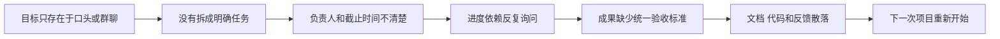
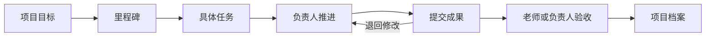

# AgileCampus 开题报告 PPT 逻辑与讲解说明

这份说明用于帮助组员理解项目，并完成约 8 分钟的开题汇报。它不是要求逐字背诵的稿子。演讲者应先理解项目逻辑，再按照每页的重点自然表达。

配套 PPT 文件：`AgileCampus开题报告_基础逻辑版_v6.pptx`

项目仓库：<https://github.com/AwaSubaru-486/agilecampus>

## 一句话说明项目

AgileCampus 是一款面向高校实验室、课程团队和学科竞赛团队的轻量化项目管理平台。它把原本分散在群聊、在线文档和组会中的目标、任务、进度、反馈和成果整理到一条可追踪的项目流程中，并在此基础上使用 AI 辅助查询、整理、提醒和任务规划。

如果老师在听完之后只能记住一句话，希望他记住：

> AgileCampus 帮助高校团队把一个模糊的项目目标，逐步变成有人负责、能够推进、可以验收并最终留下成果的项目过程。

## 一 项目逻辑

### 1 项目为什么存在

高校团队通常已经在使用很多工具：

- 群聊负责沟通；
- 在线文档负责共同编辑；
- GitHub 或网盘保存代码和文件；
- 线下组会负责汇报；
- 老师通过口头或聊天消息提出反馈。

问题不在于完全没有工具，而在于这些工具之间没有形成连续的项目过程。

一个任务可能从群聊中产生，在文档里修改，在组会上汇报，最后通过网盘或代码仓库提交。团队成员知道自己做过事情，但系统无法稳定回答下面几个问题：

- 当前目标是什么；
- 下一步由谁负责；
- 任务为什么这样安排；
- 当前卡在哪里；
- 什么结果才算完成；
- 老师给过什么反馈；
- 项目结束后留下了哪些成果。

因此，AgileCampus 解决的不是单一的“看板不好用”或者“聊天信息太多”，而是项目过程缺少连续记录的问题。

### 2 问题是怎样一步步产生的



这个问题链解释了为什么平台不能只增加一个聊天窗口，也不能只做一个任务看板。平台需要同时连接目标、任务、执行、验收和项目档案。

### 3 平台的基本解决方式

AgileCampus 把高校项目简化为五个环节：

1. **计划**：确定目标、里程碑、交付物和时间。
2. **执行**：把目标拆成任务，设置负责人和截止时间。
3. **沟通**：围绕具体任务记录进度、讨论和阻塞。
4. **验收**：成员提交成果，负责人或老师通过、退回并留下反馈。
5. **沉淀**：保存文档、成果链接、反馈、决策和复盘记录。

这五个环节不是五个互相独立的菜单，而是同一条项目链路。



### 4 平台需要保存哪些信息

项目要形成连续记录，至少需要下面几类对象：

| 对象 | 保存的内容 | 解决的问题 |
| --- | --- | --- |
| 项目 | 项目名称、团队、目标、周期 | 大家正在共同完成什么 |
| 里程碑 | 阶段目标、交付物、日期 | 项目现在应该走到哪里 |
| 任务 | 任务说明、负责人、截止时间、状态 | 谁在什么时间完成什么 |
| 过程记录 | 进度更新、讨论、风险、阻塞 | 为什么任务停住或改变 |
| 成果 | 文档、代码、链接、实验结果 | 成员实际交付了什么 |
| 验收反馈 | 通过、退回、修改意见 | 为什么这项任务算完成 |
| 项目档案 | 成果、反馈、复盘和重要决策 | 项目结束后留下什么 |

平台的核心不是某个页面，而是这些对象之间能够相互关联。例如，老师看到一份成果时，可以继续查看它属于哪项任务、由谁提交、对应哪个里程碑、为什么通过验收。

### 5 三类用户分别负责什么

#### 学生成员

学生进入平台后最需要知道的是“我现在应该做什么”。因此学生端重点展示：

- 自己负责的任务；
- 截止时间和优先级；
- 任务背景和验收标准；
- 当前需要回应的反馈；
- 可以提交成果的位置。

#### 项目负责人

负责人需要把目标转成可执行的安排，重点关注：

- 目标是否已经拆成任务；
- 每项任务是否有负责人；
- 当前项目是否存在阻塞；
- 哪些成果等待验收；
- 哪个里程碑可能延期。

#### 指导老师

老师不需要持续介入每个操作，而需要一个快速了解项目的入口：

- 项目整体进度；
- 当前风险和阻塞；
- 学生提交的成果；
- 历史反馈是否得到处理；
- 项目结束后的完整档案。

### 6 一个任务在平台中怎样完成

以“整理中期材料”为例：

1. 负责人在项目里创建任务，写明需要整理哪些材料、截止时间和验收要求。
2. 负责人把任务分配给一名成员，或者由成员主动认领。
3. 成员查看与任务关联的资料、历史讨论和老师要求。
4. 成员更新进度。如果缺少实验数据，可以记录为阻塞并通知相关成员。
5. 成员完成后提交报告文件或成果链接。
6. 负责人或老师查看成果，选择通过或退回，并写下原因。
7. 通过后的成果自动进入项目档案，与任务、提交者和反馈保持关联。

这条链路就是当前 MVP 最需要跑通的内容。

### 7 AI 为什么要加入以及在哪里加入

AI 不是平台成立的前提。即使暂时关闭 AI，计划、任务、推进、验收和档案也应该能够正常运行。

AI 的作用是降低整理信息和推动流程的成本，分为四层：

#### 第一层 查询助手

AI 读取项目中的结构化信息，回答：

- 目前有哪些任务逾期；
- 本周完成了什么；
- 哪些任务等待老师验收；
- 某项决策是怎样形成的。

#### 第二层 文档助手

AI 根据项目内容生成：

- 组会纪要；
- 自动周报；
- 文档摘要；
- 答辩材料初稿。

#### 第三层 流程助手

AI 主动发现：

- 任务长期没有更新；
- 里程碑可能延期；
- 某个成员任务过多；
- 下次组会需要讨论的问题。

#### 第四层 轻量项目经理

AI 可以提出需求拆解、任务拆分和迭代计划，但只生成建议。成员确认后，建议才能转成正式任务或修改项目计划。

AI 的边界必须讲清楚：

> AI 可以读取、整理、提醒和提出方案；创建正式任务、修改关键计划、认定任务完成和验收成果仍由人确认。

### 8 AI 与普通聊天机器人的区别

普通聊天机器人主要处理一轮对话。AgileCampus 中的 AI 需要和项目对象关联：

- 它知道当前讨论属于哪个项目；
- 它知道当前任务、负责人和截止时间；
- 它能够引用项目资料和历史反馈；
- 它产生的建议可以被成员确认或拒绝；
- 它的建议和处理结果会留在项目记录中。

因此，AI 的重点不在于“回答得像人”，而在于能否在明确权限下推动一个真实任务。

### 9 当前阶段做什么 不做什么

#### 当前阶段必须完成

- 建立项目、目标和里程碑；
- 创建、分配和更新任务；
- 记录阻塞和风险；
- 提交成果并进行验收；
- 保存老师反馈和项目档案；
- 验证基础 AI 查询、整理和提醒。

#### 当前阶段暂不作为重点

- 复杂的企业权限系统；
- 财务、采购和人力资源功能；
- 大规模组织管理；
- AI 自动替代负责人作出决定；
- 覆盖所有项目类型的高度可配置流程。

这样划分是为了保证项目首先成为一个能够使用的高校团队协作工具，而不是功能很多但无法完成基本任务的演示系统。

### 10 项目的区别和创新点

与群聊和在线文档相比，AgileCampus 提供任务责任、状态、验收和项目档案。

与 Jira、PingCode 等企业工具相比，AgileCampus 减少复杂字段和流程配置，使用高校团队熟悉的语言组织功能。

与普通 AI 聊天助手相比，AgileCampus 的 AI 与项目、任务、资料和验收流程关联，并受到人工确认边界的约束。

因此，项目的特色可以概括为：

> 轻量高校项目流程，加上有上下文、有人确认、能留下记录的 AI 辅助。

## 二 PPT 的整体叙事逻辑

整套 PPT 按照下面的顺序展开：

```text
现实问题
  ↓
谁遇到问题
  ↓
平台是什么
  ↓
项目怎样运转
  ↓
需要哪些基础功能
  ↓
AI 在哪里帮助
  ↓
当前已经做到什么
  ↓
怎样通过调研和测试验证
  ↓
下一阶段做什么
```

这个顺序的关键是：先让老师理解项目管理平台，再介绍 AI。不要在老师还不知道平台是什么时，就开始讲 Agent、上下文继承或工作分支。

## 三 每页 PPT 的作用

### 第 1 页 项目名称

这一页回答“你们要做什么”。

必须说清楚三个信息：

- 产品名称是 AgileCampus；
- 服务对象是高校项目团队；
- 基本作用是把分散的项目过程整理成可追踪流程。

不要在第一页展开技术栈、Agent 或竞品。

过渡句：

> 我们为什么认为高校团队需要这样一个平台，可以从一次常见的课程项目说起。

### 第 2 页 项目背景

这一页回答“问题是否真实存在”。

先讲具体场景，再讲外部研究。外部数据只能证明协作成本值得研究，不能代替本校学生调研。

过渡句：

> 同一个问题对不同角色的影响并不一样，所以我们先明确平台服务谁。

### 第 3 页 目标用户

这一页回答“谁会使用”。

强调学生、负责人和老师的需求不同。不要把所有人笼统叫作“项目用户”。

过渡句：

> 确定用户之后，平台的定位也就比较清楚了。

### 第 4 页 平台定位

这一页回答“它和群聊、企业工具有什么区别”。

AgileCampus 保留计划、执行、沟通、验收和沉淀五个环节，但减少复杂配置。

过渡句：

> 这五个环节放到一个真实课程项目里，会形成下面这条流程。

### 第 5 页 项目流程

这一页回答“项目怎样在平台里完成”。

沿着建立目标、拆分任务、持续推进、提交验收和归档成果依次说明。这里是整套 PPT 最重要的一页。

过渡句：

> 为了让这条流程真正跑起来，平台首先需要四组基础能力。

### 第 6 页 核心功能

这一页回答“平台具体做什么”。

不要逐个念十几个功能名称。用项目计划、任务推进、反馈验收、成果沉淀四组功能概括。

过渡句：

> 基础流程成立以后，AI 才有明确的数据和任务可以帮助处理。

### 第 7 页 AI 辅助

这一页回答“AI 为什么需要以及怎样介入”。

按照查询、整理、提醒和规划四层说明。一定要补充人工确认边界。

过渡句：

> 目前我们已经围绕基础流程做出了可运行的原型界面。

### 第 8 页 当前原型

这一页回答“现在是不是只有想法”。

左图说明怎样查看成员状态、阻塞和里程碑；右图说明怎样保存反馈、文档和成果。不要把时间用在解释每个按钮。

过渡句：

> 有了原型并不代表我们的判断已经成立，下一步还需要真实用户验证。

### 第 9 页 调研与验证

这一页回答“你们怎样证明它有用”。

说明问卷、访谈和原型测试分别解决什么问题。样本量是当前计划，不要说成已经完成的数据。

过渡句：

> 因此，开题之后的工作重点不是继续堆功能，而是完成核心闭环并通过测试迭代。

### 第 10 页 阶段目标

这一页回答“接下来做什么、最后交付什么”。

用确认问题、完善原型、测试迭代三个阶段收束。最后展示仓库地址。

结束句：

> 我们希望最终交付的不只是一组页面，而是一套高校团队能够实际使用、能够被验证的项目协作流程。谢谢老师。

## 四 八分钟参考讲稿

以下讲稿按照约 7 分 40 秒设计，留出约 20 秒用于停顿、换页或临场补充。

### 第 1 页 约 25 秒

大家好，我们组的项目是 AgileCampus，一款面向高校实验室、课程团队和学科竞赛团队的轻量化项目管理平台。我们想解决的问题是，项目的目标、任务、进度和成果经常分散在群聊、在线文档和组会里，团队缺少一条能够从开始持续到结束的项目记录。AgileCampus 希望把这个过程整理成计划、执行、沟通、验收和沉淀五个环节。

### 第 2 页 约 55 秒

先看一个常见场景。负责人在群里问谁来整理中期材料，有人回复“我看看”，但这句话没有变成一个明确任务。几天后大家才发现没有真正的负责人，最后只能在截止前重新收集文档和代码。这里的问题不是成员完全没有做事，而是目标没有拆成任务，责任没有落到个人，成果也没有统一归档。外部研究也说明协作和贡献不均并不是个别现象。不过这些数据只用于提出问题，高校场景是否存在同样情况，还要通过我们自己的问卷和访谈验证。

### 第 3 页 约 40 秒

平台主要服务三类用户。学生成员需要快速知道自己今天要做什么；项目负责人需要知道项目现在走到哪一步、哪里存在风险；指导老师需要查看进度、给出反馈并验收成果。课程大作业、实验室课题和学科竞赛虽然内容不同，但都需要在有限时间内完成分工、推进和验收。

### 第 4 页 约 45 秒

AgileCampus 的定位位于群聊和企业项目管理工具之间。群聊和在线文档使用灵活，但任务、责任和成果容易分散。Jira 等企业工具流程完整，但字段、权限和配置对学生团队比较重。我们保留高校团队真正需要的五个环节，也就是计划、执行、沟通、验收和沉淀，让团队能看到项目怎样从目标走到成果。

### 第 5 页 约 50 秒

一个项目进入平台后，先建立目标、里程碑和交付物，再把目标拆成有负责人、截止时间和验收标准的任务。成员在执行过程中更新进度，记录阻塞；完成后提交文档、代码或成果链接；负责人或老师可以通过或退回，并留下修改意见；通过后的成果进入项目档案。当前阶段最重要的目标，是先把一项任务从创建、执行到验收和留档完整跑通。

### 第 6 页 约 45 秒

围绕这条流程，平台首先完成四件事。第一是项目计划，保存目标和里程碑；第二是任务推进，明确负责人和截止时间；第三是反馈验收，记录风险、老师意见和验收结果；第四是成果沉淀，集中保存文档、成果链接和复盘。自动周报、风险提醒和档案导出，都建立在这些基础能力之上。

### 第 7 页 约 50 秒

AI 在基础流程之上逐步介入。它可以回答项目进度问题，可以整理会议纪要和周报，可以发现逾期与风险，也可以辅助需求分析和任务拆分。介入越深，越需要明确人工边界。我们的原则是，AI 可以读取信息、整理内容、提醒问题和提出方案，但是正式创建任务、修改关键计划以及验收成果，仍然需要成员确认。

### 第 8 页 约 60 秒

目前我们已经做出了可运行的原型。左边是项目现场页，它集中展示成员状态、当前阻塞和下一里程碑，负责人和老师不用逐个询问成员就能理解项目情况。右边是项目记录页，老师反馈、团队文档和成果链接会留在同一个项目档案里。当前原型已经覆盖项目推进和成果沉淀两个关键环节，后续会继续补齐任务创建和验收过程。

### 第 9 页 约 55 秒

下一阶段会通过三种方法验证我们的判断。问卷用于了解学生现在怎样分配任务、追踪进度和保存材料；访谈分别了解学生成员、项目负责人和指导老师的需求；原型测试观察用户能否找到任务、更新进度并完成验收。当前计划收集约五十份问卷，访谈六到八人，并邀请五人左右完成原型任务。我们关注的不是页面是否好看，而是任务是否更容易找到、责任是否更清楚、成果是否更容易验收和复用。

### 第 10 页 约 35 秒

开题之后，我们先通过调研确认问题，再完善计划、任务、验收和档案这条核心闭环，最后通过测试修正交互和 AI 的介入边界。最终交付包括调研结论、可交互原型、测试结果和项目文档。当前实现已经上传到 GitHub。我们希望最终交付的是一套高校团队能够实际使用、能够被验证的项目协作流程。谢谢老师。

## 五 演讲时应避免的表达

不要说：

- “我们做了一个很强大的全能平台”；
- “AI 可以自动管理整个项目”；
- “现在所有功能都已经实现”；
- “网上数据显示学生一定存在这些问题”；
- “我们直接复用了某个项目的代码”；
- “我们的创新就是加入了 AI”；
- “以后什么功能都可以加”。

建议说：

- “当前原型已经覆盖基础流程，后续通过调研继续修正”；
- “AI 先作为辅助层，关键动作需要成员确认”；
- “外部数据用于提出问题，学生结论来自本项目调研”；
- “我们先验证一条任务闭环，再考虑扩展功能”；
- “项目参考成熟开源实现，但交互定位和高校场景由我们重新设计”。

## 六 老师可能追问的问题

### 1 为什么不用飞书群、腾讯文档或微信群

这些工具能够完成沟通和共同编辑，但不会自动形成目标、任务、责任、验收和项目档案之间的关联。AgileCampus 的价值是把分散工具中的信息组织成连续项目流程，而不是替代所有沟通工具。

### 2 为什么不用 Jira 或 PingCode

企业工具功能完善，但通常包含复杂的字段、角色、权限和研发流程配置。AgileCampus 面向规模较小、周期较短、成员经验有限的高校团队，优先保留他们能够理解和持续使用的流程。

### 3 项目的创新点是什么

创新点不是单纯加入 AI，而是把轻量高校项目流程与有项目上下文、有人确认、能留下记录的 AI 辅助结合。AI 的建议与项目、任务、资料和验收过程关联。

### 4 AI 和普通聊天机器人有什么区别

普通聊天机器人主要处理对话。平台中的 AI 能读取项目目标、任务、负责人、资料和历史反馈，并围绕具体任务提出建议。建议需要成员确认，处理结果会留在项目记录中。

### 5 现在已经实现到什么程度

当前已有可运行的项目入口、项目现场、协同空间和项目记录界面，基础数据和演示流程可以运行。任务闭环、用户研究和 AI 能力还需要继续验证和完善，因此开题中把它称为研究原型，而不是完成的商业产品。

### 6 功能这么多会不会做不完

项目按照 MVP 推进。本阶段只保证项目、里程碑、任务、推进、验收和档案形成完整闭环。自动周报、复杂风险分析和更深层 Agent 能力根据测试结果逐步加入。

### 7 你们怎样证明学生真的需要它

外部资料只能证明协作问题值得研究。我们会通过问卷、角色访谈和原型任务测试验证高校团队的具体问题，并允许调研结果修改当前功能假设。

### 8 怎样防止 AI 产生错误操作

AI 默认只读取、整理、提醒和提出建议。正式创建任务、修改计划、分配负责人和验收成果需要人工确认。系统还需要保留建议来源和操作记录，便于成员查看和撤回。

### 9 项目是否属于换皮或直接复制

项目参考开源项目的工程实现和成熟交互经验，但产品定位、用户研究、信息架构、核心流程和界面表达围绕高校场景重新设计。所有复用内容需要遵守原仓库许可证并在第三方说明中标注。

## 七 演讲前检查清单

- 能否在十秒内说清平台是什么；
- 能否用“整理中期材料”的例子讲清问题；
- 是否先讲基础项目流程，再讲 AI；
- 是否明确 AI 的人工确认边界；
- 是否把计划样本量说成“计划”，而不是既有结果；
- 是否能用一项任务讲完创建、推进、验收和归档；
- 是否知道当前原型已经实现什么、仍缺什么；
- 是否记住项目仓库地址；
- 演讲是否控制在 7 分 40 秒左右；
- 是否预留约 20 秒处理停顿和换页。

## 八 最后统一口径

组内所有成员对外介绍时，建议统一使用下面的表达：

> AgileCampus 是面向高校团队的轻量项目管理平台。它通过计划、执行、沟通、验收和沉淀五个环节，把分散的项目过程连接起来。AI 作为辅助层，帮助查询项目、整理资料、提醒风险和提出任务规划建议，关键操作仍由成员确认。当前阶段先验证一条任务从创建到归档的完整闭环，再根据问卷、访谈和原型测试结果继续迭代。

这段话能够同时回答项目是什么、解决什么问题、AI 怎样参与以及当前阶段做什么。
