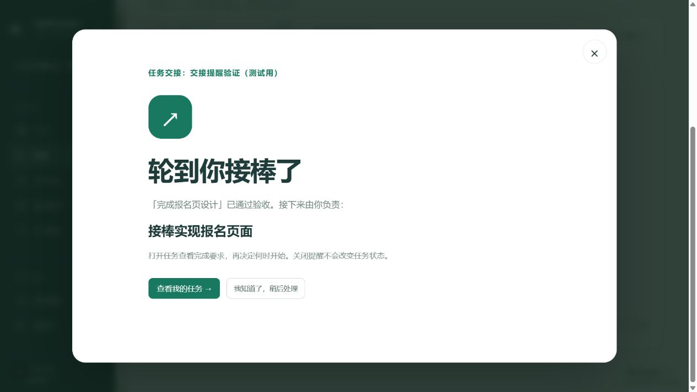

# 页面切换、交接通知与功能完成情况

检查时间：2026-10-10。本轮检查本地分支 `codex/role-task-workspace` 的代码与网页入口。

## 这次改好了什么

- 页面切换时立即显示加载提示和占位内容，侧栏、项目导航显示“正在打开”。选任务时显示“正在切换任务”，等待期间不允许操作旧任务详情。
- 同一次打开页面，项目与权限查询、项目列表、行动队列和执行台任务权限检查可以复用；项目和成员权限合成一次查询。任务列表与任务详情同时开始读取。
- 侧栏待处理数字独立加载，打开整个工作区不必等这份统计。没有长期缓存权限，下一次请求仍检查当前成员身份。
- 按钮按下有颜色与位置变化，耗时操作保留“处理中”、禁用重复提交等反馈。
- 新增站内大屏交接提醒，显示哪个任务完成、接下来轮到谁负责什么。需要主动关闭或确认；“查看我的任务”可以进入对应任务。关闭只确认通知，不替用户认领或完成任务。

这里优化了实际的查询等待和切换体验。本地开发模式首次打开某个页面仍需要编译；没有测过正式部署的大量用户场景，不能把这次检查说成所有情况下都没有卡顿。

## 通知什么时候发

“完成”按验收通过计算。只提交成果或被退回，不催下一位开始。原有管理员直接标记完成的入口也保留并接入提醒；重复标记不会重复发，重开再完成可产生新一轮提醒。

1. 设置了后置任务时，通知这些任务的负责人。多个前置任务要全部通过验收。
2. 没设置后置任务时，按任务树顺序找同阶段、同里程碑中的下一项未完成任务。没有负责人时无收件人；提醒不会替项目猜一个人。
3. 锁定阶段暂不通知。阶段集成审核通过、下一阶段开放后，通知新阶段中已具备前置条件的任务负责人。
4. 不通知已完成或待验收的任务，也不向同一个交付人重复催自己的下一项任务。导师与 AI 成员不接收执行接棒提醒。
5. 提醒保存在账户里，离线也不会丢；打开网页时读取，页面可见时每 15 秒检查一次，回到窗口时立即检查。确认后再次登录也不会重复弹出。
6. 改派、退出团队、改成导师、任务进入待验收/已完成、项目归档时，旧提醒不再显示。多人同时验收和重复点击不会为同一交接产生重复提醒。

这次是网页内通知；未增加浏览器系统推送或外部消息发送。

## 三项功能实际做到了哪里

### 1. 版本迭代：阶段推进已经能用，代码合并还要人来做

后端能保存项目需求，生成和修改任务草案，发布本轮任务，继续追加下一轮。每轮按阶段推进：成员交付并通过验收、登记交付分支后，组长提交阶段集成，其他组长或导师审核，通过才开放下一阶段。审核者不能审核自己提交的阶段集成。

前端入口在项目的“规划与集成”；组员看到“阶段与交付”，导师看到“集成审核”。这里有“规划下一轮”、阶段切换、交付分支登记、集成提交和审核；另有时间线。任务详情还提供会话分支、检查点共享和接续记录。

还没有做到：网站不会实际合并 Git 分支，也不会在这套阶段提交流程中去仓库确认分支存在或替用户运行测试。分支名称、提交编号和测试说明由人填写。检查点接续有独立的数据校验，但不能把它当成阶段已经自动完成真实代码合并。

### 2. 任务分派与任务树：主要流程已连起来，还有误派和顺序限制

后端能保存负责人、父子任务、前后置关系和完成要求。任务经过认领、交付、验收，验收不通过可退回修改。本轮补上验收后的接棒提醒。

前端能在待确认草案里修改负责人、增加新任务、修改完成要求，再保存发布；执行台和看板能查看、管理任务。阶段页以分层任务树显示阶段、父子任务、负责人和状态。任务编辑中可以设置多个后置任务。

还需要补齐：后端允许把普通执行任务分配给导师，但导师无法认领、提交，可能出现“派给了却做不了”的情况。前后置关系目前用于展示和交接提醒，仍不会强制禁止成员提前开始；阶段本身有开工限制。

### 3. 三角色分工：界面已经分开，全部功能的权限隔离还没彻底完成

| 角色 | 实际工作 | 网页入口 |
| --- | --- | --- |
| 组长 | 安排分工、发布任务树、处理阻塞、验收成果、组织阶段集成 | 项目推进台、分工与执行、规划与集成、AI 协作、交付与复盘 |
| 组员 | 默认查看自己的任务，认领、执行、提交成果和登记交付 | 我的交付台、我的任务、阶段与交付、AI 助手、成果与记录 |
| 导师 | 默认查看待验收成果，审核任务和阶段集成，给出评审 | 导师审核台、成果验收、集成审核、评审与复盘 |

后端会限制组员自证完成、导师认领和提交、导师验收自己的成果等操作。组长可以验收自己负责的任务；阶段集成的提交人则不能自审。项目共享进度和资料仍允许成员查看。

但还有两处没有完全关住：组员可以修改其他任务的普通资料；导师虽然没有 AI 协作导航，后端创建 AI 会话仍只要求是项目成员。这里实现了不同工作界面，尚不能说所有功能都已严格按三角色封闭。本轮未改变这些既有权限规则。

## 源码核对位置

- 阶段、任务草案和交付：`src/lib/task-tree.ts`，`src/app/(app)/projects/[projectId]/task-tree/page.tsx`、`draft-editor.tsx`、`task-tree-forms.tsx`。
- 分派、父子任务、后置关系与验收：`src/lib/task.ts`；执行台、`task-card.tsx`、`_console/task-contract-panel.tsx`。
- 角色首页与导航：`src/lib/project-role-workspace.ts`，`_shared/project-role-home.tsx`、`_shared/project-navigation.tsx`。
- 角色的权限缺口：`src/lib/task.ts` 的普通任务写入及负责人校验；`src/lib/agent/conversation.ts` 的 `createConversation`。
- 接续版本记录：`src/lib/checkpoint.ts`、`_console/task-contract-panel.tsx`。
- 通知保存与读取：`src/lib/task-notifications.ts`，`src/app/api/notifications/route.ts`，`_shell/task-notification-inbox.tsx`。

## 验证记录

- 14 个定向测试文件，118 项通过，覆盖通知、并发验收、前置条件、阶段解锁、登录与通知归属、角色、任务和教程，以及原有飞书提醒、任务认领与项目列表。
- 生产构建通过，ESLint 无错误，30 项警告为已有未改文件；UI 文案检查通过。
- 数据表迁移已用于本地开发库与测试库。其他部署需执行 `scripts/migrations/2026-10-10-task-handoff-notifications.sql`。
- 浏览器使用单独的“交接提醒验证（测试用）”项目：真实成员提交，组长点击验收，接棒人收到大屏提醒；点击叉号成功确认，刷新后不再显示，接棒任务仍是待办。验证项目已归档，正式演示项目任务未改。
- 项目列表、项目首页、任务详情和阶段页均在浏览器验证；阶段页的一次已编译页面切换，点击至标题出现约 422 毫秒，包含工具往返，不是标准性能基准，也没有旧版本对照，不据此宣称提升百分比。
- 本次三角色入口结合源码与既有三账号页面验证记录核对，详情见 `docs/reviews/role-project-workspace/README.md`。没有在这次浏览器验证中对正式项目提交阶段集成或修改角色。

