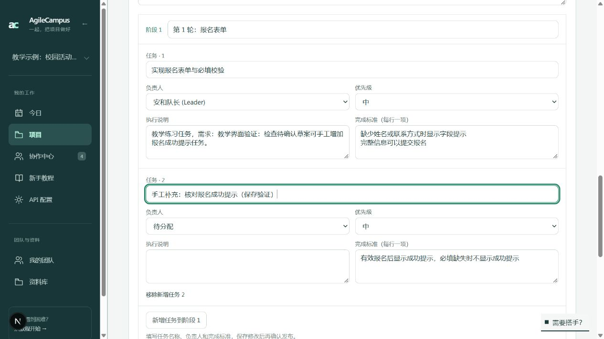
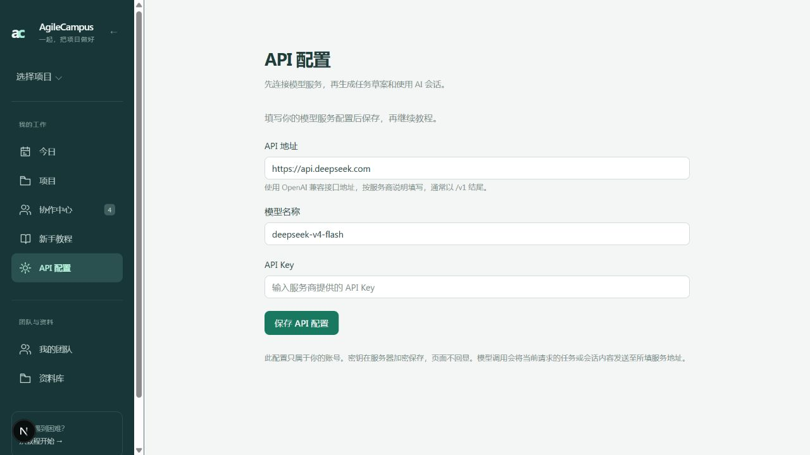
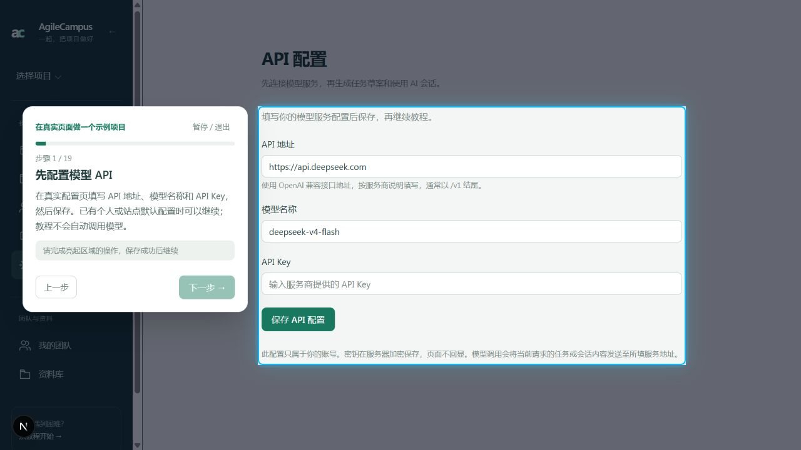

# 草案新增任务与 API 配置引导

2026-10-09，按用户要求实施。

- 待确认草案每个阶段新增“新增任务”按钮。任务沿用名称、负责人、优先级、执行说明和完成标准编辑；生成唯一 key，保存后纳入原有发布链路。误加任务可移除，遵守单阶段 40 项 / 单草案 60 项的已有上限。
- 未保存时不能发布；保存后阻止表单自动重置，避免负责人和优先级在视觉上回到第一项。
- 侧栏常驻 `/settings/api`，支持 OpenAI 兼容服务地址、模型名称与 API Key。认证用户只能保存自己的配置。API Key 使用 AES-256-GCM 加密，以服务器 AUTH_SECRET（兼容 NEXTAUTH_SECRET）派生密钥，页面不回显；后续留空可保留已有密钥。
- 任务树生成与项目 AI 会话优先使用操作者个人配置，未配置时沿用服务器 DeepSeek 配置。其他后台提炼和风险解读仍沿用站点配置。
- 示例主教程升级到 19 步，第一步在真实 API 配置页高亮表单。没有个人或站点配置时，前后端都阻止进入下一步；保存配置不会自动发送模型请求。旧主教程进度暂停到新版第一步，保留已有实际项目和其他功能课程记录。另增“配置模型 API”独立课程。

## 数据库

新增 `user_model_configs` 表，增量 SQL 位于 `scripts/migrations/2026-10-09-user-model-config.sql`，已应用到本地开发和测试数据库。其他环境可按项目原有 `npm run db:push` 流程同步，或执行该增量 SQL。服务器加密凭据需要稳定保存；更换凭据后，原个人 API Key 需重新配置。

## 验证

- 6 个定向测试文件、26 项通过：密钥加密和账号隔离、留空保留密钥、个人模型选择、不合法地址拒绝、人工新增任务保存与发布、API 教程门禁、旧进度迁移、数据库重置以及 AI 会话回归。
- 生产构建、文案检查通过；ESLint 无错误，30 个既有警告均在本轮未修改文件。
- 浏览器在原有练习项目生成教学草案，实际新增任务、保存并刷新确认，未保存时发布禁用，保存后负责人 / 优先级没有重置。保留一份待确认草案供查看，没有发布任务或调用外部模型。
- 完整教程实际启动到“步骤 1 / 19：先配置模型 API”，表单高亮、未配置时下一步禁用。最后暂停在第一步，预览保留 API 配置页面。
- 未填入用户真实密钥、未进行付费模型请求；实际服务可用性在用户配置后调用时验证，保存成功不标记为连接成功。

