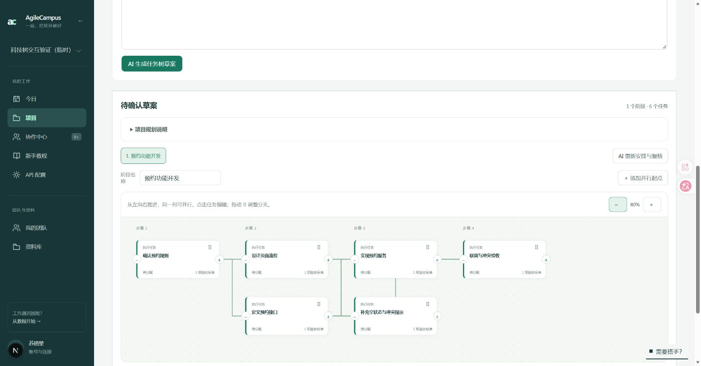

# 草案任务科技树（2026-10-10）

待确认草案改为横向编排画布：先做的在左侧，同一层展示可并行的任务，汇合任务允许多个前置。点击节点才展开负责人、优先级、说明和验收标准，避免同时铺开全部表单。

- 拖动节点的 ⠿，放到“接在此任务后”“与此任务并行”或“移到起点”。禁止形成循环，也可在详情中用前置复选框调整多个连接。
- 节点后方加号打开新增表单。填写名字后，可以显式请求 AI 对照项目目标判断位置、重复工作与验收标准；建议展示后，用户自行应用或修改。
- 前方减号打开二次确认，列出所有受影响后续任务。可保留后续并接回原前置，也可一起删除；共享汇合节点同样列入删除提示。禁止把最后一个阶段删空。
- 初次打开尚无关系标记的草案，AI 先安排关系，再独立复核必要前置、并行机会、汇合条件和循环。展示复核结论与各任务连接理由，不把数组顺序冒充依赖。分析失败可手动操作，等待时可停止分析。

## 保存边界

任务名称、负责人、验收标准等继续走原来的草案保存和发布流程。未改数据库结构、任务状态、阶段解锁、集成审核或验收逻辑。

新增的 `/api/draft-planning` 仅提供 AI 建议：登录、同站来源、组长权限和待确认草案校验后，使用当前用户的模型配置读取项目说明；不写草案、任务或审核。停止分析会传递取消信号。

**编排连线只存在当前浏览器的 localStorage，并绑定草案内容版本。不会跨设备同步，也不会在发布后变成后端执行门禁。** 原 `parentKey` 仍然表示任务分组，不能作为执行前置。选择保留后续任务时，原分组子任务会继承被删除分组的上级。

## 验证

- Vitest：草案关系、AI 建议、原任务树发布/阶段审核、教程，共 26 项通过。AI 模拟模型验证了两次独立调用、采用第二轮结果、读取真实项目目标、拒绝循环与未知前置、拒绝组员以及不写草案/任务。
- 实际浏览器：独立临时项目内验证键盘拖放、前置复选框的并行与汇合、新增任务、显式 AI 请求、停止等待、取消删除、保留后续删除、原保存入口及重载后的关系恢复。未发布测试任务，测试项目随后归档。
- 当前 API 的真实分析请求未成功完成，因此不宣称真实模型成功生成建议；错误提示和恢复手动编辑已实际验证。
- 生产构建通过；全仓 lint 无错误，有 30 项既有警告；页面文案检查通过。

下面为手动编排并保存后的实际页面，非 AI 生成结果：

