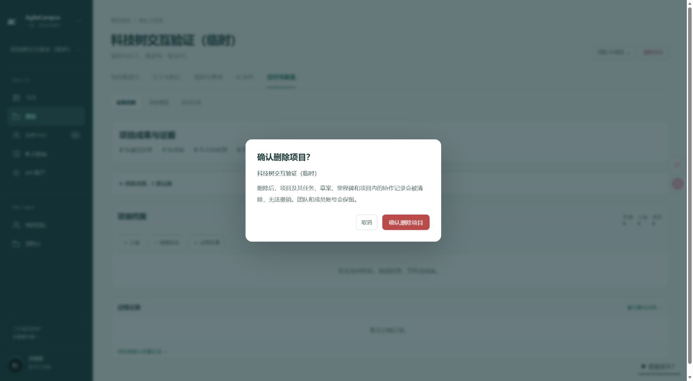

# 项目删除入口修复

项目列表的进行中卡片、归档列表与项目页右上角均提供删除入口，仅组长可见。继续复用原有 deleteProject 服务端权限校验和数据库清理逻辑。

确认弹窗显示项目名与清理范围，默认聚焦取消，支持 Escape 和取消按钮，提交时禁用按钮。使用原生 dialog 避免被菜单或卡片裁切。去掉客户端对所有异常的捕获，避免吞掉 Next 的正常删除后跳转；删除后刷新共享页面缓存并返回项目列表。

验证：项目领域 14 项测试通过，包含删除带任务、草案和里程碑的项目，以及保留团队、成员账号与其他项目。生产构建、lint（0 错误，30 项既有警告）与文案检查通过。浏览器验证了两个入口、归档入口、确认弹窗、取消和 Escape；没有实际删除用户项目。

