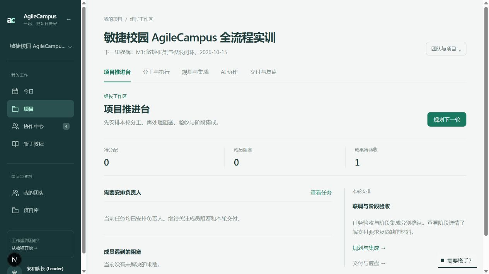
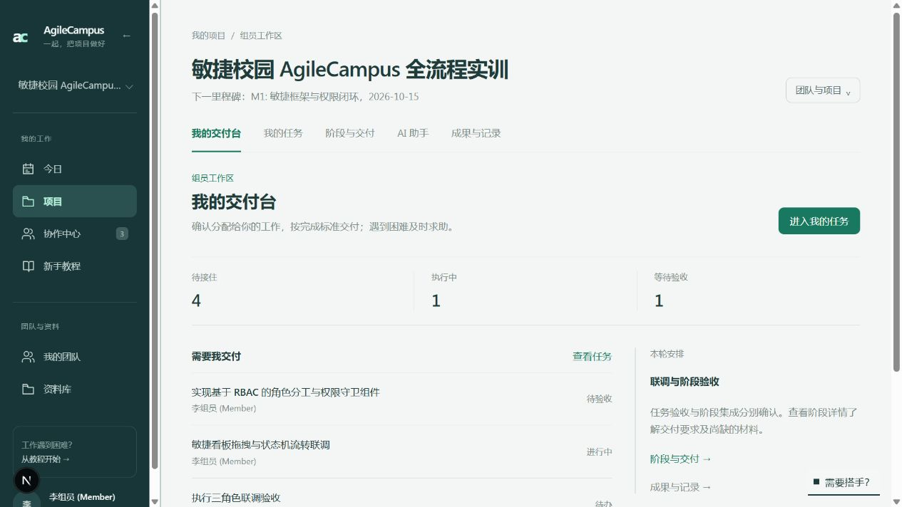
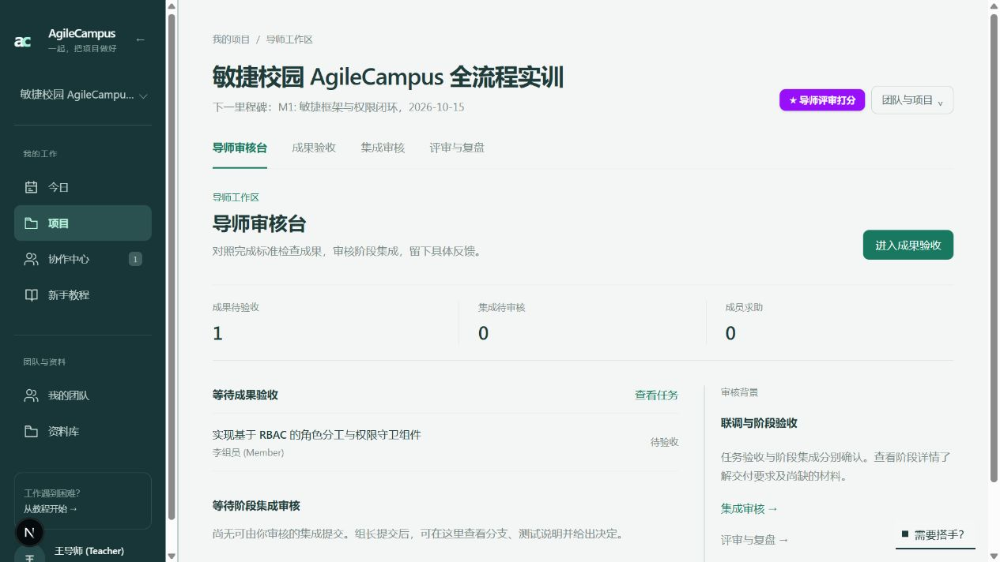

# 按项目角色组织工作界面

2026-10-08，依据 [UI / UX 学习笔记](../../design/2026-10-08-ui-ux-learning.md) 实施。

## 页面设计

进入同一个项目时，从服务端获取当前用户在所属团队的真实角色，展示不同首页、导航和默认任务队列。没有手动角色切换器。

| 项目角色 | 首屏工作 | 主要入口 | 默认任务范围 |
| --- | --- | --- | --- |
| 组长 admin | 安排负责人、处理成员阻塞、推进交付 | 项目推进台、分工与执行、规划与集成、AI 协作、交付与复盘 | 全团队任务 |
| 组员 student | 接住分配给自己的任务并交付 | 我的交付台、我的任务、阶段与交付、AI 助手、成果与记录 | 本人任务；阶段页也默认本人任务 |
| 导师 teacher | 检查交付证据、审核阶段集成和评审 | 导师审核台、成果验收、集成审核、评审与复盘 | 待验收且非本人负责的任务 |

首页采用工作队列、简明数量与阶段背景，避免把全部表单堆在首屏。管理入口收进“团队与项目”；导师不展示执行者的 AI 工作入口。共享任务、历史和进度仍可显式查看。

任务详情按原有权限展示动作。列表、看板、打开任务、返回列表及筛选保留任务范围；`scope=all` 与看板分组参数 `group` 分离。看板筛选只修改筛选字段，保留所在页面和选中的任务。删除重复的嵌套筛选折叠层。

原任务、会话和审批深链接继续进入既有工作页面。互动教程保留原页面上的目标标记，不迁入角色首页，也未改任务状态机。

## 分工的源码依据

- `src/lib/project.ts`：项目及里程碑管理由 admin 执行，项目成员可以读取。
- `src/lib/task.ts`：admin / student 可以写任务资料；执行要求负责人本人或 admin 代操作，teacher 不能执行；admin / teacher 可以验收。admin 可验收自己负责的任务，teacher 不可。
- `src/lib/task-tree.ts`：admin 生成、发布、规划和提交阶段集成；分支登记由 admin 或任务负责人执行；阶段集成由 admin / teacher 审核，提交人不可自审。

功能隔离是角色工作面的优先级与入口隔离，不把原本可共享查看的资料当成私密数据。后端鉴权继续作为权限边界。本轮没有扩大或改写角色权限；例如，源码允许 student 写普通任务资料，不应声称其所有写操作都被禁止。

任务范围在数据库分页之前过滤，避免先读 50 项再筛选导致组员或导师漏看自己的任务；筛选游标绑定范围和当前用户。

## 验证

- 定向 Vitest：7 个文件、73 项通过，覆盖角色默认范围、超过一页的本人任务、导师不能自审、游标范围、URL 状态保留、任务权限、阶段流程及教程回归。
- 生产构建通过；UI 文案检查通过；ESLint 无错误，30 个既有警告均位于本轮未修改文件。
- 本地演示项目用组长、组员和导师三个账号验证；组员列表 6 项、显式全部 8 项，导师默认 1 项待验收。导师详情显示验收表单，没有认领和提交成果动作。
- 390 × 844 窄屏验证没有页面横向溢出。看板切换分组再回列表，保留 `scope=all` 与 `group=priority`。
- 浏览器验证未提交任务、验收或集成，不改变业务状态；组员账号首次教程提示选择暂时跳过，最终恢复组长账号。
- 当前演示项目没有待审核的阶段集成；该分支由领域测试覆盖，浏览器只验证阶段只读界面及空态。

## 页面截图

组长：

组员：

导师：

[导师验收详情](teacher-review.png) / [导师窄屏首页](teacher-mobile.png)
