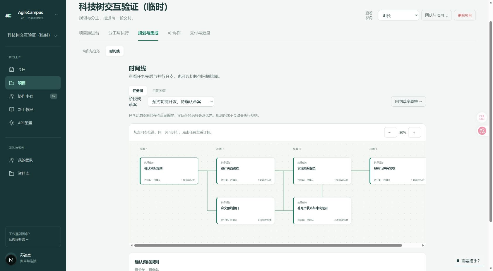
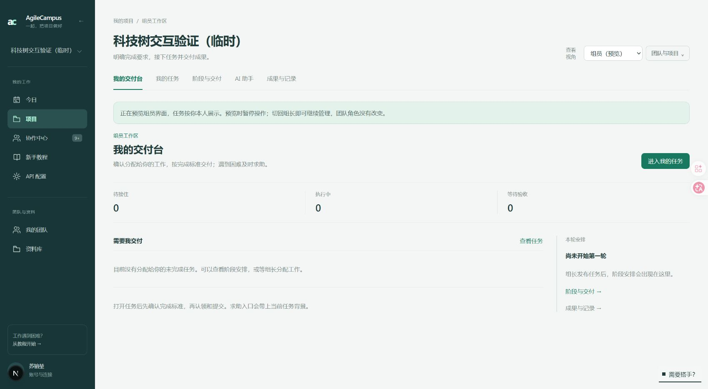

# 时间线任务树与组长视角预览

后续已升级为跨阶段连续科技树，当前行为和验证以 [连续科技树说明](continuous-tree.md) 为准，下文保留首次版本记录。

## 使用入口

- 项目 → 规划与集成 → 时间线默认展示任务树。可选择已发布阶段，组长还能选择待确认草案；点击节点查看负责人、状态、说明和验收标准，已发布任务提供详情入口。日期排期保留为旁边的切换入口。
- 项目右上角新增“查看视角”。组长可选择组员或老师预览，项目首页、任务页面和导航随角色变化。切回组长恢复管理入口。
- 预览保持当前登录者身份，不冒充某个成员；“我的任务”仍按组长本人展示。预览期间暂停项目表单操作，团队成员的实际角色和后端权限不变。

## 连线的来源与边界

时间线复用草案编辑器的科技树布局，并以只读方式展示。项目中实际保存的任务后续关系优先；草案编排仍读取当前浏览器的本地缓存，没有新增数据库写入或 AI 调用。

已发布任务只在任务名称唯一、未改名且任务集合完整匹配时恢复原草案编排，避免把连接套到错误任务。失效缓存、删除或改名后无法可靠匹配的编排会被忽略。缺少关系时只显示节点，不把列表顺序当成执行依赖。当前按阶段查看树，同一阶段内显示连线；跨阶段关系没有画成连线。

草案的本地编排不会自动跨电脑同步。其他电脑能看到项目中已经保存的实际任务关联，但不一定看到这台电脑的草案连线。

## 视角切换实现

仅项目实际组长能保存项目级预览选择。选择使用项目路径范围内的 HttpOnly 会话 Cookie，不修改成员表。非组长的预览 Cookie 不生效。

切换使用表单提交并返回原项目路径。返回地址限定在当前项目内，采用相对重定向，避免开发服务器内部的 localhost 地址把浏览器从 127.0.0.1 带走而看起来退出登录。时间线按任务树或日期排期分别加载所需数据。

## 验证

- 相关自动化测试覆盖角色预览权限、Cookie 范围、项目内返回地址、原访问主机保持、草案映射、并行与汇合关系、错误编排拒绝，以及既有任务树和教程逻辑。
- 全量 lint 无错误，保留仓库既有警告；本次修改文件的定向 lint 无警告。UI 文案检查和生产构建通过。
- 浏览器验证了待确认草案分支、任务详情、缩放、日期视图，以及组员和老师的首页与导航预览。切回组长后管理入口恢复。另在现有项目验证已发布阶段树可读取，缺少连接时正确提示，不伪造顺序。
- 未发布、删除或更改用户项目业务数据；截图使用已有临时验证项目。

## 截图

