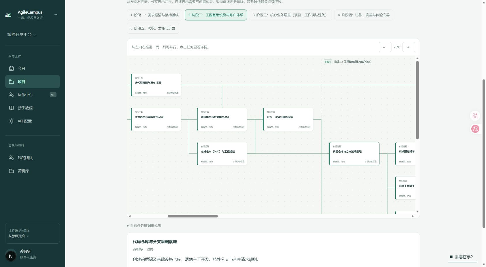

# 连续项目科技树（2026-10-10）

本次替代原来“一次查看一个阶段”的布局：草案编辑器与时间线都把同一份规划的全部阶段画在同一张可横向滚动的图中。阶段占据连续的列，阶段交界用竖向虚线分隔。阶段按钮用于定位图中的位置，不切断整条任务链。

## AI 分析

AI 根据项目目标、任务说明和验收要求识别必要前置、并行分支、多个产物的汇合，以及跨阶段需要交接的具体成果。第一轮提出完整关系，第二轮逐条复核。禁止按数组顺序假定依赖、把分组当执行任务，或依赖未来阶段的任务。校验拒绝循环、遗漏、重复和不存在的任务。

模型输入与输出使用短任务别名，校验后还原真实任务 ID，避免 UUID 在每条连线中反复出现导致输出过长。绘制时隐藏已经通过中间节点表达的重复捷径，保留全部前置可达关系；原分析结果及执行关联不被删除。

时间线可分析已发布项目的整条任务链；后端自行读取真实任务和项目说明，不采信客户端提交的任务列表。仅实际组长可调用，使用当前用户的模型配置。已有执行关联必须保留。分析是只读建议，没有修改任务状态、分派、通知或阶段审核规则。

没有缓存时，组长打开树会启动分析；有有效缓存时直接展示，也可以点击“AI 分析整条任务链”重新分析。分析可停止；失败时展示明确提示，不生成虚假连线。每轮模型调用设有超时，避免页面无限等待。

## 编辑与保留

草案仍支持拖拽调整分支、加号新增并请 AI 完善任务、减号二次确认删除。删除时会列出全部关联后续，包括后面阶段的任务；可以保留后续并接回原前置，也可以一起移除。空阶段会重排编号，不允许删光整份草案。

规划缓存升级到关系版本 2，旧版只分析单阶段的缓存不能冒充跨阶段分析结果。草案发布后，在各阶段任务名称唯一且任务集合完整匹配时，可把原草案 key 映射为真实任务 ID，保留已保存的跨阶段连接和手动调整。改名、删除或同名歧义不会猜测连接。

规划建议仍保存在当前浏览器，未改为共享数据库关系。跨电脑共享的仍是项目已保存的实际执行关联。连线只是规划建议，后续阶段的实际开放仍受原集成审核流程控制。

## 自动化验收

37 项相关测试通过，覆盖跨阶段分叉与汇合、竖线不穿节点、独立并行起点、重复捷径绘制简化、未来阶段拒绝、跨阶段删除及保留、发布后 ID 映射、两轮 AI 复核、短标记还原、真实任务读取、已有执行关系保护和只读权限边界，以及原任务树、角色和教程回归。

生产构建、UI 文案检查通过。全量 lint 无错误，保留原有 30 个警告；本次修改文件定向 lint 无警告。

## 真实浏览器验收

在现有“敏捷开发平台”项目调用当前配置的真实模型，完成两轮分析后成功展示全部 42 个任务、5 个阶段与 4 条竖向虚线。原建议有 151 条前置连线，其中 64 条跨阶段；绘图去除可由中间节点表达的重复捷径后展示 62 条直接连接。验证了阶段定位、70% 缩放和任务详情；例如“代码仓库与分支策略落地”会连接前一阶段的架构决策与工程规范，并说明连接依据。

最初使用完整 UUID 的调用发生超时；缩短任务别名与说明后重试成功。首轮真实分析仍需要等待，已完成的结果在同一浏览器会直接恢复。业务任务、角色、分派和状态未改动。

